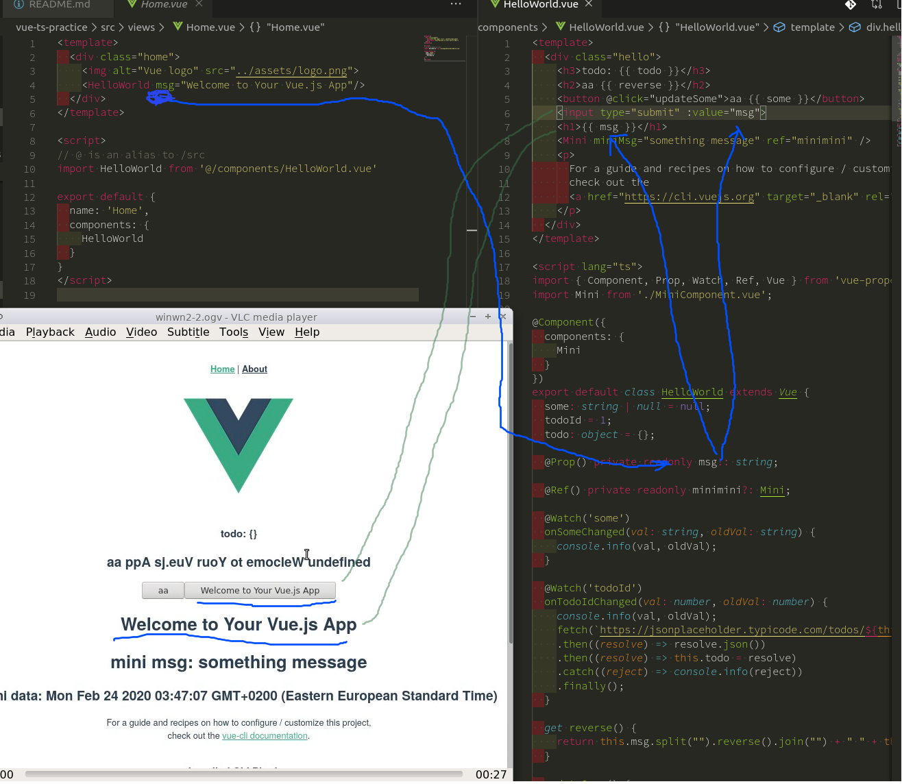
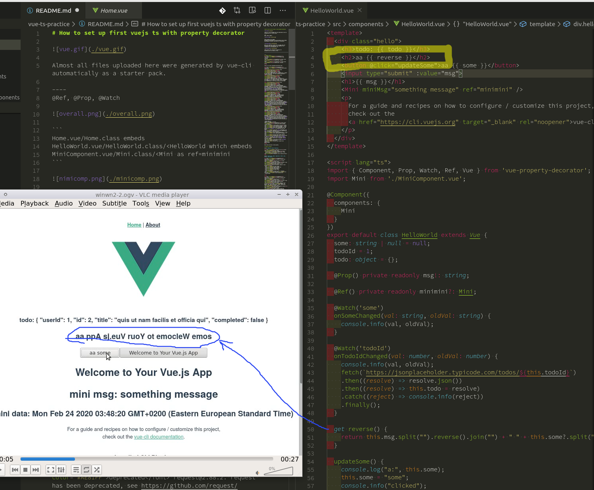

# How to set up first vuejs ts with property decorator


Almost all files uploaded here were generated by vue-cli automatically as a starter pack.

----
@Ref, @Prop, @Watch, get=computed member=data

mounted() || created() = @PostConstruct/constructor lifecycle


```
1. Home.vue/Home.class embeds
2. HelloWorld.vue/HelloWorld.class/<HelloWorld which embeds
3. MiniComponent.vue/Mini.class/<Mini as ref=minimini
```


While except the icon image, components on the top came from HelloWorld.vue, the bottom part of components were originated from MiniComponents.vue.



These vaules were injected from Home.vue to HelloWorld.vue to be shown in html.



This reversed string was coming from this **get** function returning the computed value.


That JSON is a member variable of HelloWorld.class. This member variable was changed in this flow.
```
Button click ->
@click -> updateSome() method
In updateSome() todoId++.
todoId is Watched -> onTodoIdChanged() method
In onTodoIdChanged() the todo Object was updated.
```


This Date value was a member variable of Mini.class. But through the component Ref via name-binding of minimini, by a method updateFoo() remotely called from HelloWorld.class, the vaule was updated each time that the button bound to updateSome() was clicked.

# Reactivity in Vue.js

https://vuejs.org/2016/02/06/common-gotchas/#Why-isn%E2%80%99t-the-DOM-updating

Swapping two array objects perhaps breaks the object tie and so as the object tracking functionality of vue and the reactivity. Using array.splice and array.push might solve that problem.

----

# Install vue-cli
<pre><font color="#A6E22E"><b>ryoji@ubuntu</b></font>:<font color="#66D9EF"><b>~</b></font>$ node --version
v12.15.0
<font color="#A6E22E"><b>ryoji@ubuntu</b></font>:<font color="#66D9EF"><b>~</b></font>$ npm --version
6.13.7
<font color="#A6E22E"><b>ryoji@ubuntu</b></font>:<font color="#66D9EF"><b>~</b></font>$ yarn --version
1.21.1
</pre>

https://cli.vuejs.org/guide/installation.html

<pre><font color="#A6E22E"><b>ryoji@ubuntu</b></font>:<font color="#66D9EF"><b>~</b></font>$ npm install -g @vue/cli
<span style="background-color:#272822"><font color="#F8F8F2">npm</font></span> <span style="background-color:#F4BF75"><font color="#272822">WARN</font></span> <font color="#AE81FF">deprecated</font> request@2.88.2: request has been deprecated, see https://github.com/request/request/issues/3142
<span style="background-color:#272822"><font color="#F8F8F2">npm</font></span> <span style="background-color:#F4BF75"><font color="#272822">WARN</font></span> <font color="#AE81FF">deprecated</font> core-js@2.6.11: core-js@&lt;3 is no longer maintained and not recommended for usage due to the number of issues. Please, upgrade your dependencies to the actual version of core-js@3.
..
<span style="background-color:#272822"><font color="#F8F8F2">npm</font></span> <span style="background-color:#F4BF75"><font color="#272822">WARN</font></span> <font color="#AE81FF">enoent</font> SKIPPING OPTIONAL DEPENDENCY: ENOENT: no such file or directory, rename &apos;/home/ryoji/node-v12.15.0-linux-x64/lib/node_modules/@vue/cli/node_modules/fsevents/node_modules/util-deprecate&apos; -&gt; &apos;/home/ryoji/node-v12.15.0-linux-x64/lib/node_modules/@vue/cli/node_modules/fsevents/node_modules/.util-deprecate.DELETE&apos;
<span style="background-color:#272822"><font color="#F8F8F2">npm</font></span> <span style="background-color:#F4BF75"><font color="#272822">WARN</font></span> <font color="#AE81FF">optional</font> SKIPPING OPTIONAL DEPENDENCY: wrappy@1.0.2 (node_modules/@vue/cli/node_modules/fsevents/node_modules/wrappy):
<span style="background-color:#272822"><font color="#F8F8F2">npm</font></span> <span style="background-color:#F4BF75"><font color="#272822">WARN</font></span> <font color="#AE81FF">enoent</font> SKIPPING OPTIONAL DEPENDENCY: ENOENT: no such file or directory, rename &apos;/home/ryoji/node-v12.15.0-linux-x64/lib/node_modules/@vue/cli/node_modules/fsevents/node_modules/wrappy&apos; -&gt; &apos;/home/ryoji/node-v12.15.0-linux-x64/lib/node_modules/@vue/cli/node_modules/fsevents/node_modules/.wrappy.DELETE&apos;
<span style="background-color:#272822"><font color="#F8F8F2">npm</font></span> <span style="background-color:#F4BF75"><font color="#272822">WARN</font></span> <font color="#AE81FF">optional</font> SKIPPING OPTIONAL DEPENDENCY: yallist@3.1.1 (node_modules/@vue/cli/node_modules/fsevents/node_modules/yallist):
<span style="background-color:#272822"><font color="#F8F8F2">npm</font></span> <span style="background-color:#F4BF75"><font color="#272822">WARN</font></span> <font color="#AE81FF">enoent</font> SKIPPING OPTIONAL DEPENDENCY: ENOENT: no such file or directory, rename &apos;/home/ryoji/node-v12.15.0-linux-x64/lib/node_modules/@vue/cli/node_modules/fsevents/node_modules/yallist&apos; -&gt; &apos;/home/ryoji/node-v12.15.0-linux-x64/lib/node_modules/@vue/cli/node_modules/fsevents/node_modules/.yallist.DELETE&apos;

+ @vue/cli@4.2.2
updated 5 packages in 63.557s
<font color="#A6E22E"><b>ryoji@ubuntu</b></font>:<font color="#66D9EF"><b>~</b></font>$ yarn global upgrade --latest @vue/cli
<font color="#F8F8F2"><b>yarn global v1.21.1</b></font>
<font color="#A5A5A1">[1/4] Resolving packages...</font>
<font color="#A5A5A1">[2/4] Fetching packages...</font>
<font color="#66D9EF">info</font> fsevents@1.2.11: The platform &quot;linux&quot; is incompatible with this module.
<font color="#66D9EF">info</font> &quot;fsevents@1.2.11&quot; is an optional dependency and failed compatibility check. Excluding it from installation.
<font color="#A5A5A1">[3/4] Linking dependencies...</font>
<font color="#A5A5A1">[4/4] Rebuilding all packages...</font>
<font color="#A6E22E">success</font> Saved lockfile.
<font color="#F4BF75">warning</font> Your current version of Yarn is out of date. The latest version is &quot;1.22.0&quot;, while you&apos;re on &quot;1.21.1&quot;.
<font color="#66D9EF">info</font> To upgrade, run the following command:
<font color="#A5A5A1">$ sudo apt-get update &amp;&amp; sudo apt-get install yarn</font>
<font color="#A6E22E">success</font> Saved 0 new dependencies.
Done in 8.07s.
</pre>

Note that yarn does it more quickly.

# Create a project

Select **Manually select features**.

<pre><font color="#66D9EF"><b>Vue CLI v4.2.2</b></font>
<font color="#A6E22E">?</font> <font color="#F8F8F2"><b>Please pick a preset:</b></font> 
  default (<font color="#F4BF75">babel</font>, <font color="#F4BF75">eslint</font>) 
<font color="#A1EFE4">❯ Manually select features</font></pre>

Select **[dart-sass, babel, typescript, router, vuex, eslint, unit-jest]**

<pre><font color="#A6E22E"><b>ryoji@ubuntu</b></font>:<font color="#66D9EF"><b>~/dev</b></font>$ vue create vue-ts-practice
<font color="#66D9EF"><b>Vue CLI v4.2.2</b></font>
<font color="#A6E22E">?</font> <font color="#F8F8F2"><b>Please pick a preset:</b></font> <font color="#A1EFE4">Manually select features</font>
<font color="#A6E22E">?</font> <font color="#F8F8F2"><b>Check the features needed for your project:</b></font> 
 <font color="#A6E22E">◉</font> Babel
 <font color="#A6E22E">◉</font> TypeScript
 ◯ Progressive Web App (PWA) Support
 <font color="#A6E22E">◉</font> Router
 <font color="#A6E22E">◉</font> Vuex
 ◯ CSS Pre-processors
 <font color="#A6E22E">◉</font> Linter / Formatter
<font color="#A1EFE4">❯</font><font color="#A6E22E">◉</font><font color="#A1EFE4"> Unit Testing</font>
 ◯ E2E Testing

</pre>

<pre><font color="#A6E22E"><b>ryoji@ubuntu</b></font>:<font color="#66D9EF"><b>~/dev</b></font>$ vue create vue-ts-practice
<font color="#66D9EF"><b>Vue CLI v4.2.2</b></font>
<font color="#A6E22E">?</font> <font color="#F8F8F2"><b>Please pick a preset:</b></font> <font color="#A1EFE4">Manually select features</font>
<font color="#A6E22E">?</font> <font color="#F8F8F2"><b>Check the features needed for your project:</b></font> <font color="#A1EFE4">Babel, TS, Router, Vuex, CSS Pre-processors, Linter, Unit</font>
<font color="#A6E22E">?</font> <font color="#F8F8F2"><b>Use class-style component syntax?</b></font> <font color="#A1EFE4">Yes</font>
<font color="#A6E22E">?</font> <font color="#F8F8F2"><b>Use Babel alongside TypeScript (required for modern mode, auto-detected polyfills, transpiling JSX)?</b></font> <font color="#A1EFE4">Yes</font>
<font color="#A6E22E">?</font> <font color="#F8F8F2"><b>Use history mode for router? </b></font><font color="#F4BF75"><b>(Requires proper server setup for index fallback in production)</b></font> <font color="#A1EFE4">No</font>
<font color="#A6E22E">?</font> <font color="#F8F8F2"><b>Pick a CSS pre-processor (PostCSS, Autoprefixer and CSS Modules are supported by default):</b></font> <font color="#A1EFE4">Sass/SCSS (with dart-sass)</font>
<font color="#A6E22E">?</font> <font color="#F8F8F2"><b>Pick a linter / formatter config:</b></font> <font color="#A1EFE4">Basic</font>
<font color="#A6E22E">?</font> <font color="#F8F8F2"><b>Pick additional lint features:</b></font> (Press <font color="#A1EFE4"><b>&lt;space&gt;</b></font> to select, <font color="#A1EFE4"><b>&lt;a&gt;</b></font> to toggle all, <font color="#A1EFE4"><b>&lt;i&gt;</b></font> to invert selection)<font color="#A1EFE4">Lint on save</font>
<font color="#A6E22E">?</font> <font color="#F8F8F2"><b>Pick a unit testing solution:</b></font> <font color="#A1EFE4">Jest</font>
<font color="#A6E22E">?</font> <font color="#F8F8F2"><b>Where do you prefer placing config for Babel, ESLint, etc.?</b></font> <font color="#A1EFE4">In dedicated config files</font>

<font color="#66D9EF"><b>Vue CLI v4.2.2</b></font>
✨  Creating project in <font color="#F4BF75">/media/dev/vue-ts-practice</font>.
🗃  Initializing git repository...
⚙️  Installing CLI plugins. This might take a while...

&gt; yorkie@2.0.0 install /media/dev/vue-ts-practice/node_modules/yorkie
&gt; node bin/install.js

setting up Git hooks
done

&gt; core-js@2.6.11 postinstall /media/dev/vue-ts-practice/node_modules/babel-runtime/node_modules/core-js
&gt; node -e &quot;try{require(&apos;./postinstall&apos;)}catch(e){}&quot;
&gt; core-js@3.6.4 postinstall /media/dev/vue-ts-practice/node_modules/core-js
&gt; node -e &quot;try{require(&apos;./postinstall&apos;)}catch(e){}&quot;
&gt; ejs@2.7.4 postinstall /media/dev/vue-ts-practice/node_modules/ejs
&gt; node ./postinstall.js

added 1427 packages from 1058 contributors and audited 935171 packages in 34.409s

36 packages are looking for funding
  run `npm fund` for details

found <font color="#A6E22E">0</font> vulnerabilities

🚀  Invoking generators...
📦  Installing additional dependencies...

added 77 packages from 38 contributors and audited 937716 packages in 18.213s

43 packages are looking for funding
  run `npm fund` for details

found <font color="#A6E22E">0</font> vulnerabilities

⚓  Running completion hooks...

📄  Generating README.md...

🎉  Successfully created project <font color="#F4BF75">vue-ts-practice</font>.
👉  Get started with the following commands:

<font color="#A1EFE4"> </font><font color="#75715E">$</font><font color="#A1EFE4"> cd vue-ts-practice</font>
<font color="#A1EFE4"> </font><font color="#75715E">$</font><font color="#A1EFE4"> npm run serve</font>
</pre>

# test:unit
<pre><font color="#A6E22E"><b>ryoji@ubuntu</b></font>:<font color="#66D9EF"><b>~/dev/vue-ts-practice</b></font>$ npm run test:unit

&gt; vue-ts-practice@0.1.0 test:unit /media/dev/vue-ts-practice
&gt; vue-cli-service test:unit

<span style="background-color:#A6E22E"><font color="#272822"><b> PASS </b></font></span> tests/unit/<font color="#F8F8F2"><b>example.spec.ts</b></font>
  HelloWorld.vue
    <font color="#A6E22E">✓</font> renders props.msg when passed (25ms)

<font color="#F8F8F2"><b>Test Suites: </b></font><font color="#A6E22E"><b>1 passed</b></font>, 1 total
<font color="#F8F8F2"><b>Tests:       </b></font><font color="#A6E22E"><b>1 passed</b></font>, 1 total
<font color="#F8F8F2"><b>Snapshots:   </b></font>0 total
<font color="#F8F8F2"><b>Time:</b></font>        2.702s
<font color="#A5A5A1">Ran all test suites.</font></pre>

also yarn
<pre><font color="#A6E22E"><b>ryoji@ubuntu</b></font>:<font color="#66D9EF"><b>/media/dev/vue-ts-practice</b></font>$ yarn run test:unit
<font color="#F8F8F2"><b>yarn run v1.21.1</b></font>
<font color="#A5A5A1">$ vue-cli-service test:unit</font>
<span style="background-color:#A6E22E"><font color="#272822"><b> PASS </b></font></span> tests/unit/<font color="#F8F8F2"><b>example.spec.ts</b></font>
  HelloWorld.vue
    <font color="#A6E22E">✓</font> renders props.msg when passed (27ms)

<font color="#F8F8F2"><b>Test Suites: </b></font><font color="#A6E22E"><b>1 passed</b></font>, 1 total
<font color="#F8F8F2"><b>Tests:       </b></font><font color="#A6E22E"><b>1 passed</b></font>, 1 total
<font color="#F8F8F2"><b>Snapshots:   </b></font>0 total
<font color="#F8F8F2"><b>Time:</b></font>        1.331s, estimated 3s
<font color="#A5A5A1">Ran all test suites.</font>
Done in 2.23s.</pre>

# run build
<pre><font color="#A6E22E"><b>ryoji@ubuntu</b></font>:<font color="#66D9EF"><b>~/dev/vue-ts-practice</b></font>$ npm run build

&gt; vue-ts-practice@0.1.0 build /media/dev/vue-ts-practice
&gt; vue-cli-service build


<font color="#A1EFE4">⠙</font>  Building for production...Starting type checking service...
Using <font color="#F8F8F2"><b>1 worker</b></font> with <font color="#F8F8F2"><b>2048MB</b></font> memory limit
<font color="#A1EFE4">⠹</font>  Building for production...

<span style="background-color:#A6E22E"><font color="#272822"> DONE </font></span> <font color="#A6E22E">Compiled successfully in 7307ms</font>                                                                                                                <font color="#75715E">01:48:30</font>

  <font color="#A1EFE4"><b>File</b></font>                                 <font color="#A1EFE4"><b>Size</b></font>               <font color="#A1EFE4"><b>Gzipped</b></font>

  <font color="#A6E22E">dist/js/chunk-vendors.845312db.js</font>    139.08 KiB         48.12 KiB
  <font color="#A6E22E">dist/js/app.c80b1de8.js</font>              6.96 KiB           2.43 KiB
  <font color="#A6E22E">dist/js/about.865db47c.js</font>            0.44 KiB           0.31 KiB
  <font color="#66D9EF">dist/css/app.5b4febbc.css</font>            0.42 KiB           0.26 KiB

  <font color="#75715E">Images and other types of assets omitted.</font>

<span style="background-color:#A6E22E"><font color="#272822"> DONE </font></span> Build complete. The <font color="#A1EFE4">dist</font> directory is ready to be deployed.
<span style="background-color:#66D9EF"><font color="#272822"> INFO </font></span> Check out deployment instructions at <font color="#A1EFE4">https://cli.vuejs.org/guide/deployment.html</font>
</pre>

# run serve
<pre><span style="background-color:#A6E22E"><font color="#272822"> DONE </font></span> <font color="#A6E22E">Compiled successfully in 2344ms</font>                                                                                                                <font color="#75715E">03:39:50</font>

Type checking in progress...

  App running at:
  - Local:   <font color="#A1EFE4">http://localhost:</font><font color="#A1EFE4"><b>8080</b></font><font color="#A1EFE4">/</font> 
  - Network: <font color="#A1EFE4">http://192.168.0.15:</font><font color="#A1EFE4"><b>8080</b></font><font color="#A1EFE4">/</font>

  Note that the development build is not optimized.
  To create a production build, run <font color="#A1EFE4">npm run build</font>.

<font color="#A6E22E">No type errors found</font>
Version: typescript <font color="#F8F8F2"><b>3.7.5</b></font>
Time: <font color="#F8F8F2"><b>3372</b></font>ms
</pre>

# plugins
https://github.com/vuejs/vue-cli/tree/dev/packages/%40vue

----


## Project setup
```
npm install
```

### Compiles and hot-reloads for development
```
npm run serve
```

### Compiles and minifies for production
```
npm run build
```

### Run your unit tests
```
npm run test:unit
```

### Lints and fixes files
```
npm run lint
```

### Customize configuration
See [Configuration Reference](https://cli.vuejs.org/config/).
